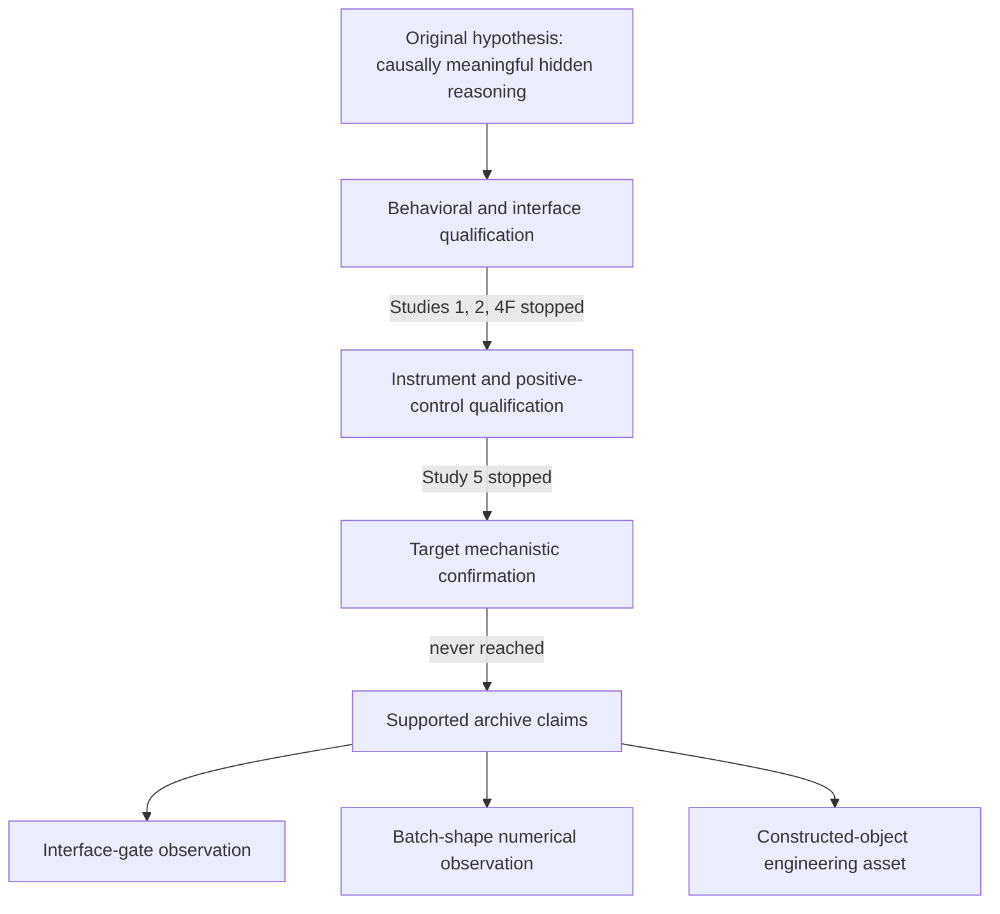

# Experiment index

This index separates executed observations from plans, reviews, and unopened stages. `Confirmed` below means that a committed artifact and an independent arithmetic or integrity check agree on the narrow statement shown; it never means that the original J-space hypothesis was confirmed.

## Status vocabulary

- **Confirmed (engineering):** reproducible within the recorded implementation and claim ceiling.
- **Preliminary:** an executed developmental observation without independent scientific confirmation.
- **Inconclusive:** data exist, but the registered design cannot resolve the intended question.
- **Failed gate:** a registered prerequisite failed; downstream scientific stages were not opened.
- **No execution:** protocol or review work only.
- **Needs replication:** a narrow result exists but external validity is limited.

## Registry

| ID | Question | Setup / input | Executed result | Primary evidence | Status | Maximum licensed claim |
|---|---|---|---|---|---|---|
| S1-P1.0C | could candidate tasks provide behavioral headroom? | 300 generated rows | 156 correct, 100 incorrect, 44 unresolved; two cells were 7/10 with wide Wilson intervals | [evidence ledger EV-0004](paper/evidence_ledger.csv) | Inconclusive | preliminary behavior screen only |
| S1-P1.0D | could a larger semantic-review pack be scored? | 900 generated rows | generation completed; final semantic labels and cell metrics were never obtained | [Study 1 README](studies/study1/README.md) | Failed gate | transport-capacity result, no scientific metric |
| S1-S2 | were independent J-lens fits technically reproducible? | A600, B600, 50:50 M1200; 27 source layers | lossless finite objects and exact merge; A/B max relative-Frobenius fell from 0.217365 at n=64 to 0.073860 at n=600 | [S2/S3 handoff](docs/jlens_s2_s3_e0_final_handoff.md) | Confirmed (engineering) | engineering identity and one convergence trajectory, not lens validity |
| S1-S3-E0 | could the frozen raw interface populate confirmation? | 238 official items, one greedy forward each | behavioral eligibility 2/93, 2/55, 5/90; confirmation 0 in all families | [terminal manifest](studies/study1/terminal_manifest.json) | Failed gate | interface did not populate confirmation |
| S2-BD | could the target clear a frozen no-generated-token feasibility gate? | 384 development items; 3 checkpoints; 3,072 rows | target NT D2+D3: 25/128 and 33/128; both below critical count 43 | [gate decision](studies/study2/stage_bd/stage_bd_gate_a_decision.json) | Failed gate | protocol v1 feasibility failed; mechanism unmeasured |
| S3-P0-T | were registered digit surfaces executable under the scorer? | 4,902 member encodes across a 32-state census | byte round trips passed, but S2/S3 digit surfaces were two tokens and the registered single-position rule was not executable | [P0-T disposition](studies/study3/pilot/p0/results/p0-t/P0_T_DISPOSITION.md) | Failed gate | tokenizer/scorer incompatibility, not model capability |
| S3-v0.7 | did the protocol survive focused review? | one independent review plus mutation checks | 12 blocking, 3 major, 2 minor findings; protocol rejected | [terminal decision](studies/study3/reviews/v0_7_operator_terminal_decision.md) | No execution | protocol invalidity only |
| S3R-v1 | did the clean-room successor survive focused review? | independent recalculation, tokenizer reconstruction, mutations | 4 blocking, 5 major, 2 minor findings; candidate rejected | [terminal closure](studies/study3r/STUDY3R_TERMINAL_CLOSURE.md) | No execution | protocol invalidity only |
| S4F-M1 | could a natural positive reference qualify across CoT and raw-direct routes? | 7B/14B/32B ladder; D2/D3; 10 cells run | 7B/14B CoT 97/104–104/104, but four paired E0 cells were 0/60 and all unparseable; 32B D3 CoT failed | [cell results](studies/study4f/execution-m1/cell_results.json) | Preliminary / failed gate | interface-dependent developmental qualification result |
| S5-EQ1 | could a J-lens workspace band be established? | DeepSeek-R1-Distill-Qwen-7B positive reference; independent A/B fits | Q3 recovery 0.6379 passed; Q4a coverage and null-margin criteria failed | [Study 5 closure](studies/study5/closure/STUDY5_CLOSURE.md) | Failed gate | no workspace band at tested scale and rule |
| S5-EQ2 | was the tested lens construct informative beyond identity/readout? | registered external controls and identity-distance ladder | late layers were close to scaled identity/readout; no passing positive control | [EQ2 D-1 conclusion](studies/study5/qualification-eq2/d1/D-1_conclusion.json) | Failed gate | apparatus degeneracy in tested controls, not general J-lens invalidity |
| S5-P0 | did registered activation patching show causal use? | 190 ordered units, 184 after guard; 92 clusters; 29 depths | positive control 0.9862 passed, but guaranteed no-op was nonzero and baseline/ceiling defects made verdict uninterpretable | [P-0 closure](studies/study5/validation-p0/P0_CLOSURE.json) | Inconclusive | instrument failure; withheld direction is not a result |
| S5-P0-prime | did baseline repair and the replacement estimand pass? | 40-unit precision checks; 177,944 stored values; inclusion n=18 | batch-matched no-ops became exact zero; replacement was algebraically identical; n below floor 30 | [P-0-prime status](studies/study5/validation-p0-prime/STATUS.json) | Confirmed (engineering) / failed gate | repaired no-op integrity only |
| S5-P0c | could a constructed two-hop object meet accuracy and anti-retrieval floors? | 160 pairs / 320 items | clean 0.75625 below 0.80; ablated 0.115625; drop 0.640625 | [object proof](studies/study5/validation-p0c/out/object_proof.json) | Failed gate | object version not established |
| S5-P0c-2 | could a rebuilt object and closed estimand shortlist qualify? | 160 pairs / 320 items; 112 correct-both units; 4 estimands | object passed (0.840625 clean, 0.10625 ablated); all four estimands later eliminated, so no real measurement ran | [object proof](studies/study5/validation-p0c2/out/object_proof.json), [C1 check](studies/study5/validation-p0c2/measurement/out/c1_nonvacuity.json) | Confirmed (engineering) / failed gate | selection-set and harness assets only |

## Program-level evidence map

The arrows describe prerequisite order, not a causal model. Study 3/3R operated on protocol validity before scientific execution and is omitted from the main path for compactness.

## Negative and contradictory evidence retained

- Study 2 includes a lineage-base `affine_mod10` control cell at 44/128, but it has zero decision authority and cannot replace the failed target gate.
- Study 4F-M1 includes strong CoT headroom alongside complete raw-direct parse failure. Neither route invalidates the other; their discrepancy is the observation.
- Study 5 P-0's apparent directional verdict is withheld because its no-op and ceiling gates failed.
- P-0c's positional error pattern is post-hoc and is not promoted to a finding.
- P-0c-2 did not establish non-monotonicity; it failed to establish the registered monotonic ordering.
- The closed list of four estimands was exhausted. No broader estimand class was refuted.

For full objectives, procedures, measurements, interpretations, and limitations, see [`REPORT.md`](REPORT.md).
