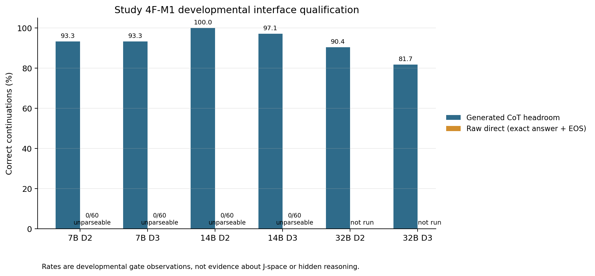
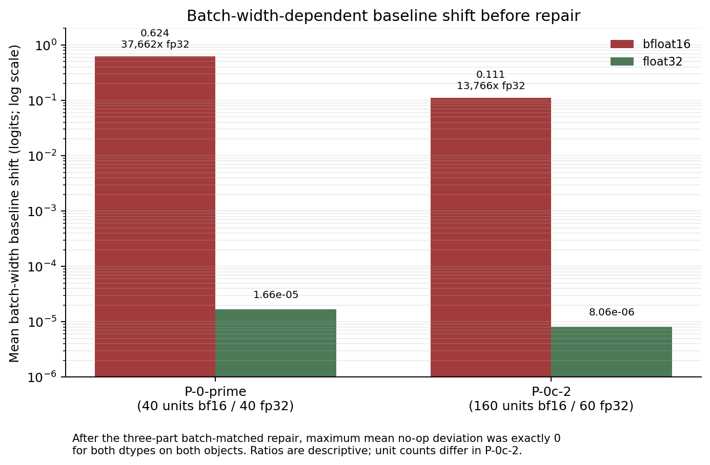

# Measurement-Gate Failures in a J-Space Observation Program: An Evidence-Based Reproducibility Report

## Abstract

Mechanistic claims about hidden reasoning require a valid behavioral interface, a qualified measurement instrument, and numerically reliable interventions. This report audits a five-study program that attempted to test whether a DeepSeek-R1 distilled checkpoint acquired an observable, causally meaningful internal reasoning process rather than only reproducing visible chain-of-thought or answer patterns. The audit reconstructs the experiment-to-evidence chain from committed code, data, receipts, terminal decisions, and independently recomputed descriptive statistics; it performs no new model inference. No study reached a valid mechanistic test of the target hypothesis. Two narrower methodological observations are nevertheless supported. First, a registered positive-reference ladder showed high generated-chain-of-thought accuracy for 7B and 14B checkpoints (93.3%–100% across four cells) while all 240 paired raw-direct continuations failed the exact answer-plus-EOS parser. Second, two activation-patching objects exhibited mean bfloat16 batch-width baseline shifts of 0.623730 and 0.110938 logits, respectively, versus 0.0000166 and 0.00000806 in float32; a batch-matched baseline, cache, and padding repair produced exact zero mean no-op deviation in the recorded runs. These observations support an empirical report about interface qualification and intervention integrity, not a conclusion about J-space, hidden reasoning, or distillation. Generalization is limited by the small number of checkpoints, tasks, hardware settings, and independent replications.

## 1. Introduction

The DeepSeek-R1 release included several dense checkpoints distilled from a larger reasoning model, creating a concrete setting in which to ask whether distilled output behavior corresponds to a transferred internal mechanism ([Guo et al., 2025](https://arxiv.org/abs/2501.12948)). The Jacobian Lens was subsequently proposed as a way to map internal activations into the model's final-layer verbalizable basis and to study a putative "J-space" ([Gurnee et al., 2026](https://arxiv.org/abs/2607.15495); [reference implementation](https://github.com/anthropics/jacobian-lens)).

This repository began with a stronger question than behavioral benchmarking: did a DeepSeek-R1 distilled checkpoint acquire an observable and causally meaningful internal reasoning process, rather than merely imitating visible chain-of-thought or answer patterns? The archive shows that this question was never validly tested. Study 1 and Study 2 stopped at behavioral eligibility or feasibility; Study 3 and Study 3R ended at protocol review; Study 4F-M1 failed to qualify a natural positive reference; and Study 5 terminated after six apparatus-level failures. The project-level decision therefore records the hypothesis as untested, not rejected ([project discontinuation](PROJECT_DISCONTINUATION.md)).

The scientifically defensible object of this report is consequently narrower: what did the measurement-development program actually observe, and which methodological lessons survive its terminal claim boundary?

### 1.1 Research questions for this report

- **RQ1 — Evidence reach:** Which stages were actually executed, and did any stage produce evidence about the target model's hidden reasoning or J-space?
- **RQ2 — Interface qualification:** How did the registered positive-reference checkpoints behave under generated-CoT and exact raw-direct interfaces?
- **RQ3 — Numerical integrity:** Did batch width and numerical precision create nonzero baselines in the activation-patching apparatus, and did the registered repair remove them in the recorded runs?
- **RQ4 — Reusable assets:** Which objects, code paths, and negative results remain useful without exceeding their evidence-supported claim ceiling?

### 1.2 Related work and scope

Activation patching and causal tracing intervene on internal states to test their contribution to an output; prior work emphasizes that metrics, corruptions, and interpretation choices can materially change conclusions ([Meng et al., 2022](https://arxiv.org/abs/2202.05262); [Zhang and Nanda, 2023](https://arxiv.org/abs/2309.16042); [Heimersheim and Nanda, 2024](https://arxiv.org/abs/2404.15255)). PyTorch's numerical-accuracy documentation also warns that mathematically equivalent floating-point computations, including batched and sliced forms, are not guaranteed to be bitwise identical ([PyTorch numerical accuracy](https://docs.pytorch.org/docs/stable/notes/numerical_accuracy.html)). These sources motivate, but do not establish, this repository's empirical observations.

This is a targeted related-work check, not a systematic novelty review. No claim of first discovery is made.

## 2. Experimental methodology

### 2.1 Audit design

The experimental archive at commit `d87c1b9e4e9dca062cebad7b6eee981d9dba8c25` was audited on 2026-09-01. The audit covered tracked Markdown and text records, Python source, configuration files, JSON/JSONL/CSV data, logs, generated outputs, figures, tests, study folders, and relevant Git history. All JSON and JSONL records examined by the repository-wide structural pass parsed successfully, all CSV files were readable, and all Python files passed AST parsing. No raw experimental file was changed.

Evidence was ranked as follows:

1. machine-readable terminal manifests, result files, receipts, and committed row-level data;
2. terminal handoffs and interpretation errata that explicitly control earlier wording;
3. frozen protocols and preregistrations;
4. historical status documents and prospective plans;
5. post-hoc diagnostics, which remain descriptive and non-decision-bearing.

Where records conflict, the later terminal or erratum record controls interpretation without rewriting the historical artifact. The report-level analysis script, [`analysis/reproduce_report.py`](analysis/reproduce_report.py), reads committed results only. It independently recomputes Study 2 exact binomial tails, Study 4F-M1 rates and Wilson intervals, and Study 5 accuracy and precision ratios. It performs no tokenization, weight loading, forward pass, generation, activation extraction, lens operation, patching, or cloud operation.

### 2.2 Variables and controls

The program did not implement one unified experiment. Its operative variables changed as the measurement apparatus was revised.

| Study | Independent variables or conditions | Dependent measures | Controls / gates | Executed units and environment |
|---|---|---|---|---|
| Study 1 | task distribution; raw-completion eligibility; independent A/B lens-fit corpus | mechanical and behavioral eligibility; engineering convergence | development-first split; held-out engineering diagnostics | 238 E0 items; two 600-sequence fits; DeepSeek-R1-Distill-Qwen-1.5B at revision `ad9f0ae...`; Tesla T4; float16 model |
| Study 2 | model role; task family; depth; no-trace and trace-conditioned arms | restricted four-option accuracy and margins | target-only conjunctive Gate A; lineage base and instruction control descriptive only | 384 development items; 3,072 rows; 18 shards; Tesla T4; Python 3.11.9, PyTorch 2.4.1+cu121, Transformers 4.46.3 |
| Study 3 / 3R | protocol mutations and methods-review criteria | reviewer severity and executable-protocol validity | independent focused review; mutation checks | no scientific model execution |
| Study 4F-M1 | checkpoint size (7B/14B/32B); depth; generated-CoT vs raw-direct route | exact correctness and parseability | preregistered natural-positive-reference ladder; target locked until qualification | 10 executed cells, 6 skipped; 4 × A100 80GB PCIe; bfloat16, batch 1 |
| Study 5 | lens-fit role; control model; layer; patch site; patch construction; dtype; batch width; constructed task version | workspace-band criteria, identity distance, patch recovery, no-op deviation, task accuracy | positive and negative controls; exact no-op families; preregistered gates | six phases; A100 80GB; primary runtime Python 3.11.14, PyTorch 2.12.0, Transformers 5.9.0, J-lens commit `581d398...` |

The independent sampling unit varies by result: item, ordered unit, cluster, fit corpus, or protocol review. GPU workers were not treated as independent scientific replicates. Seeds and immutable revisions are retained in study-specific manifests; there is no single project-wide random seed. Exact host operating-system metadata is not consistently recorded for Study 1 and Study 2 and is therefore unknown.

### 2.3 Statistical policy

Only Study 2's preregistered one-sided exact binomial gate is treated as an inferential decision. Study 4F-M1 Wilson 95% intervals are report-level descriptive intervals and did not alter any gate. Study 5 precision ratios and object accuracies are descriptive because the objects, unit counts, and execution conditions differ. No new p-value, regression, or population-level significance claim is introduced.

## 3. Experiments

### 3.1 Experiment 1 — Study 1 behavioral eligibility and lens engineering

**Objective.** Reach a confirmation set on which J-lens validity and later causal operations could be tested.

**Setup.** The 1.5B target checkpoint was evaluated on 238 frozen public items under raw completion bytes, no chat template, no generated chain-of-thought, and a greedy single-token clean-correct rule. Separately, two disjoint 600-sequence WikiText fits, A600 and B600, and their 50:50 M1200 merge were produced as engineering assets.

**Procedure and measurements.** Each E0 item received one tokenizer call and one forward pass. Mechanically eligible rows had a legal single-token answer surface; behaviorally eligible rows also required a clean correct prediction. Eligible rows were assigned development-first, so confirmation was populated only after development floors. Lens-fit matrices were checked for finiteness, lossless serialization, merge identity, and descriptive convergence.

**Results.** Mechanical eligibility was 79/93 for multihop, 36/55 for order-ops, and 83/90 for causal-swap. Behavioral eligibility was 2/93, 2/55, and 5/90. All nine eligible rows entered development; confirmation counts were zero in every distribution. There were 238 tokenizer calls, 238 model forwards, and zero lens applications in E0 ([terminal manifest](studies/study1/terminal_manifest.json)). The A/B maximum relative-Frobenius difference decreased from 0.217365 at 64 sequences to 0.073860 at 600, but this was a single engineering trajectory, not functional validation ([evidence ledger, EV-0015](paper/evidence_ledger.csv)).

**Observation.** The registered behavioral interface could not populate confirmation.

**Interpretation.** The interface was insufficient for this protocol. It does not show that the target lacks hidden reasoning or that the fitted lenses are valid or invalid.

**Limitations.** No alternative interface was compared under Study 1 authority; no lens validity, intervention, ablation, patching, or confirmation experiment ran.

### 3.2 Experiment 2 — Study 2 frozen four-option feasibility gate

**Objective.** Test whether the target could clear a frozen, zero-generated-token behavioral gate before confirmation and mechanistic stages.

**Setup.** Three 1.5B checkpoints were used: the target `deepseek-ai/DeepSeek-R1-Distill-Qwen-1.5B`, lineage base `Qwen/Qwen2.5-Math-1.5B`, and instruction control `Qwen/Qwen2.5-Math-1.5B-Instruct`, each at a recorded immutable revision. The development bank contained 384 items from `permutation_chain` and `affine_mod10` families. Across arms and depths, the execution produced 1,024 rows per model and 3,072 rows total, with zero generated tokens.

**Procedure.** Gate A used target-only, no-trace rows at depths 2 and 3: 128 rows per family, null accuracy 0.25, one-sided alpha 0.025, and a critical count of at least 43. Both families had to pass. Control cells had zero decision authority.

**Results.** The independently reproduced gate is:

| Family | Correct / n | Accuracy | Exact upper tail | Additional correct needed | Decision |
|---|---:|---:|---:|---:|---|
| `permutation_chain` | 25 / 128 | 0.1953 | 0.940352 | 18 | fail |
| `affine_mod10` | 33 / 128 | 0.2578 | 0.452685 | 10 | fail |

The conjunctive gate failed ([terminal handoff](studies/study2/STUDY2_PROTOCOL_V1_TERMINAL_HANDOFF.md); [derived metrics](analysis/report_metrics.json)). A post-hoc diagnostic found zero option-C selections in 384 target no-trace rows and accuracies near 0.25 across arms. That diagnostic is consistent with an interface or label-binding problem, but it was not preregistered and cannot identify a cause.

**Observation.** The target did not pass the registered interface-feasibility rule.

**Interpretation.** Execution and bookkeeping integrity were sufficient to apply the rule, but the result cannot distinguish an incapable checkpoint from an inadequate interface.

**Limitations.** Confirmation data remained unopened; no activation, probe, patch, ablation, or lens operation ran. The control cell that individually exceeded the threshold is not a finding because it was outside the target-only decision and one of six computed family cells.

### 3.3 Experiment 3 — Study 3 and Study 3R protocol validation

**Objective.** Construct an interface-calibration protocol that could select an executable behavioral interface and positive reference without contaminating later evidence.

**Setup and procedure.** Protocol drafts, rendering registries, schemas, independent recalculations, tokenizer reconstructions, and mutation tests were reviewed before scientific execution.

**Results.** Study 3 draft v0.7 was rejected after one independent review recorded 12 blocking, 3 major, and 2 minor findings ([terminal decision](studies/study3/reviews/v0_7_operator_terminal_decision.md)). Study 3R's successor candidate was also rejected, with 4 blocking, 5 major, and 2 minor findings; among the blocking issues were missing depth allocation, pooled-depth masking, a globally conjunctive prequalification rule, and an incomplete generated-CoT decoding contract ([Study 3R closure](studies/study3r/STUDY3R_TERMINAL_CLOSURE.md)). No scientific model execution was authorized.

**Observation.** The protocol-validation apparatus detected decision-bearing defects before model measurement.

**Interpretation.** This is evidence about protocol executability and review effectiveness, not model behavior.

**Limitations.** Review counts are not independent samples of protocol quality, and several historical scope-relative tests now expire at the project head.

### 3.4 Experiment 4 — Study 4F-M1 positive-reference ladder

**Objective.** Qualify a natural positive reference before exposing the target checkpoint to a mechanistic protocol.

**Setup.** The preregistered ladder used DeepSeek-R1-Distill-Qwen 7B, 14B, and 32B checkpoints at immutable revisions. Each candidate first ran generated-CoT headroom cells at depths D2 and D3. Raw-direct E0 cells were unlocked only for candidates that cleared both CoT cells. The CoT contract sampled up to 4,096 generated tokens and required an exact final line. The raw-direct contract used greedy decoding for at most two tokens and accepted only `[one registered answer token, EOS]`.

**Results.** Ten cells ran and six were skipped. The 7B and 14B checkpoints cleared both CoT cells but scored 0/60 in each paired raw-direct cell; all 240 raw-direct continuations were unparseable. The 7B first token was always `</think>`, while the 14B first token was always `Okay`. The 32B checkpoint passed D2 CoT but failed D3 CoT, so no 32B E0 cell ran. The target was never run ([cell results](studies/study4f/execution-m1/cell_results.json); [final disclosure](studies/study4f/execution-m1/M1_FINAL_DISCLOSURE.md)).

*Figure 1. Developmental exact-correct rates for all executed Study 4F-M1 cells. Raw-direct bars are zero because every paired continuation was unparseable under the exact answer-plus-EOS contract. Missing 32B E0 cells are shown as not run rather than zero. These are gate observations, not J-space evidence.*

Report-level Wilson intervals are shown below; they were not protocol inputs.

| Checkpoint | Depth | Route | Correct / n | Rate | Wilson 95% interval | Registered result |
|---|---|---|---:|---:|---:|---|
| 7B | D2 | CoT | 97 / 104 | 0.9327 | [0.8675, 0.9670] | pass |
| 7B | D3 | CoT | 97 / 104 | 0.9327 | [0.8675, 0.9670] | pass |
| 7B | D2 | raw direct | 0 / 60 | 0.0000 | [0.0000, 0.0602] | fail |
| 7B | D3 | raw direct | 0 / 60 | 0.0000 | [0.0000, 0.0602] | fail |
| 14B | D2 | CoT | 104 / 104 | 1.0000 | [0.9644, 1.0000] | pass |
| 14B | D3 | CoT | 101 / 104 | 0.9712 | [0.9186, 0.9901] | pass |
| 14B | D2 | raw direct | 0 / 60 | 0.0000 | [0.0000, 0.0602] | fail |
| 14B | D3 | raw direct | 0 / 60 | 0.0000 | [0.0000, 0.0602] | fail |
| 32B | D2 | CoT | 94 / 104 | 0.9038 | [0.8320, 0.9469] | pass |
| 32B | D3 | CoT | 85 / 104 | 0.8173 | [0.7322, 0.8798] | fail |

**Observation.** Success under the generated-CoT interface did not transfer to the exact raw-direct contract for the two candidates that reached E0.

**Interpretation.** Output-interface behavior was a binding qualification variable. The data do not show whether the raw-direct contract was valid or invalid for measuring internal reasoning.

**Limitations.** Routes differed in prompt wrapper, sampling, token budget, and parser; they were not a factorial manipulation of one variable. The result is developmental, uses one run per item, and includes only two paired checkpoint sizes.

### 3.5 Experiment 5 — Study 5 instrument, object, and estimand qualification

**Objective.** Establish a valid J-lens construct, a causal-patching apparatus, and a measurable two-hop object before testing the target hypothesis.

**Procedure and results.** Study 5 used sequential stop gates. Each failure limited what later phases could claim.

| Phase | Goal | Main observation | Terminal status | Claim ceiling |
|---|---|---|---|---|
| EQ1 | establish a J-lens workspace band on a positive reference | target-lens recovery passed Q3 (0.6379; bootstrap 95% [0.4714, 0.7857]), but band coverage and null-margin criteria failed Q4a | fail | no workspace band established |
| EQ2 | adjudicate whether the lens construct was informative beyond identity/readout | late-layer J-lens behavior became close to a scaled identity/readout in the tested controls | terminal negative apparatus result | no passing positive control; no architectural claim |
| P-0 | test causal use with patching | positive-control harness passed, but a guaranteed no-op was nonzero and the global ceiling mixed sites | uninterpretable | withheld causal verdict is not reportable |
| P-0-prime | repair baseline and replace estimand | batch-matched no-ops became exact zero; prescribed replacement was algebraically identical across 177,944 stored values; inclusion was 18 below floor 30 | halted | instrument-integrity result only |
| P-0c | build a two-hop object | clean accuracy 0.75625 below 0.80 floor; ablated accuracy 0.115625 | object not established | post-hoc positional pattern is not a finding |
| P-0c-2 | rebuild object and qualify estimand shortlist | object passed; all four registered estimand candidates were eliminated before a real measurement run | route terminated | selection-set and harness assets only |

#### 3.5.1 Batch-width numerical integrity

P-0 compared batch-one clean baselines with patched values computed at batch width 48. In P-0-prime, the old comparison exhibited a mean bfloat16 shift of 0.623730 logits over 40 units, versus 0.00001656 in float32 over 40 units. P-0c-2 independently re-proved the issue on a new object: 0.110938 over 160 bfloat16 units versus 0.00000806 over 60 float32 units. The bfloat16-to-float32 ratios were approximately 37,662 and 13,766, respectively. Because P-0c-2 used different unit counts across dtypes, the ratio is descriptive rather than a controlled effect estimate.

The repair had three parts: an in-batch self-patch baseline, cache capture at the same width as the consuming run, and padding every chunk to full width. Recorded `EMBED_NOOP`, `PREFIX_DONOR`, and `SELF_PATCH` maximum mean deviations were exactly zero after repair in both dtypes on both objects ([P-0-prime verifier](studies/study5/validation-p0-prime/tools/verify_baseline.py); [P-0c-2 verifier](studies/study5/validation-p0c2/tools/verify_baseline.py)).

*Figure 2. Mean logit shift between an in-batch baseline and the earlier batch-one clean forward. The logarithmic axis is explicit. Zero-valued repaired no-ops cannot be plotted on this scale and are stated in the annotation. The two phases are replications on different constructed objects, not iid repeats.*

#### 3.5.2 Constructed two-hop object

P-0c-2 built 160 name-pairs and 320 items for a `NAME → letter → digit` task. Clean accuracy was 0.840625, exceeding the registered 0.80 floor. Removing the queried name's registration line reduced accuracy to 0.10625, near the 1/9 chance rate, for a drop of 0.734375. There were 112 correct-both ordered units, no overlap between intermediate-letter and answer-digit token IDs, and a 52-token bridge span identical within each pair ([object proof](studies/study5/validation-p0c2/out/object_proof.json); [handoff](studies/study5/closure/STUDY5_HANDOFF.md)).

This establishes a selection-set engineering object. It does not show that the model represents or causally uses the letter as an internal intermediate, nor that the task transfers to natural reasoning.

#### 3.5.3 Estimand non-vacuity failure

Of four preregistered estimand candidates, only C1 survived a 20,000-draw clean-world sweep. C1 then failed four of five real-pipeline non-vacuity cases over 24 units. The no-op worst absolute mean was 0.506888 instead of zero; flatten-only and random-vector controls also failed; and the attenuated maximum mean (0.043370) exceeded the full-donor maximum (0.038606), so the registered monotonicity condition was not established. This does **not** establish statistically significant non-monotonicity and does not refute an estimand class; it exhausts the closed list of four candidates ([C1 non-vacuity result](studies/study5/validation-p0c2/measurement/out/c1_nonvacuity.json)).

## 4. Results synthesis

### 4.1 Evidence reach

| Program stage | Target behavior measured? | Valid target mechanism measured? | Terminal reason |
|---|---|---|---|
| Study 1 | yes, narrow E0 eligibility | no | zero confirmation rows |
| Study 2 | yes, development feasibility | no | target conjunctive gate failed |
| Study 3 / 3R | no | no | protocol rejected before execution |
| Study 4F-M1 | no target run | no | no natural positive reference qualified |
| Study 5 | no target hypothesis run | no | instrument and estimand line terminated |

The answer to RQ1 is therefore direct: the archive contains behavioral and apparatus evidence, but no valid mechanistic evidence about the target hypothesis.

### 4.2 Contribution assessment

| Rank | Evidence-supported contribution | Evidence strength | Reproducibility | Scientific interest | Generalizability | Overclaim risk |
|---:|---|---|---|---|---|---|
| 1 | batch-width and dtype can dominate small activation-patching effects in this apparatus; exact no-op tests exposed and then removed the recorded offset | high within two objects | high for committed arithmetic; GPU rerun requires external assets | high methodological | preliminary beyond tested stack | high if universalized |
| 2 | positive-reference qualification was strongly interface-dependent under the Study 4F contracts | medium | high for stored rows; GPU generation requires checkpoints | medium-high | limited to two paired checkpoints and two bundled routes | high if called interface validity |
| 3 | preregistered stop gates prevented apparatus failures from being misreported as a scientific null | high as an archive fact | high from Git history and terminal records | methodological | process-dependent | medium |

The report is thus an **empirical methods and reproducibility report**, not a discovery paper about internal reasoning.

## 5. Key findings

| Finding | Observation | Evidence | Interpretation | Confidence | Limitation |
|---|---|---|---|---|---|
| KF1 | two objects showed bfloat16 mean batch-width shifts of 0.623730 and 0.110938 logits, while repaired no-op means were exactly zero | Study 5 baseline JSON files and verifier code | batch-consistent baselines, caches, and chunk widths were necessary for interpretable small effects in this implementation | **high** for recorded runs | two objects, one main model/hardware stack; causal contribution of each repair component not isolated |
| KF2 | 7B/14B CoT cells scored 93.3%–100%, but all 240 paired raw-direct rows were unparseable | Study 4F-M1 cell results and journal | output interface was a binding qualification condition | **medium** | route bundles differed in several dimensions; no interface-validity conclusion |
| KF3 | every study stopped before valid target mechanistic confirmation | terminal manifests and project discontinuation | the original hypothesis is untested, not falsified | **high** | says nothing about the truth of the hypothesis |
| KF4 | P-0c-2 met its constructed-object floors (0.840625 clean; 0.10625 ablated) | object proof and committed items | a reusable selection-set object exists | **high** for object criteria | not a natural task and not evidence of an internal intermediate |
| KF5 | the tested J-lens route lacked a qualified positive control and exhausted four registered estimands | Study 5 EQ1/EQ2/P-0c-2 records | this measurement route was not ready for a target claim | **medium-high** | does not invalidate J-lens generally or refute other estimands |

## 6. Discussion

### 6.1 Evidence-supported explanation

The most coherent account of the program is a chain of failed measurement preconditions. A strict output contract prevented behavioral qualification in Studies 1, 2, and 4F-M1; protocol defects prevented Study 3/3R execution; and construct, baseline, object, or estimand gates stopped all six Study 5 phases. These stop decisions are themselves well documented and often machine checked. They explain why no target mechanism result exists without treating absence of evidence as evidence of absence.

The Study 5 no-op failures also show why intervention integrity must be tested at the same numerical shape as the measured intervention. In the recorded implementation, changing batch width altered the baseline by an amount comparable to or larger than the candidate patch effects. A control that is causally guaranteed to do nothing is therefore more informative than assuming a clean forward at another batch shape is numerically interchangeable.

### 6.2 Alternative explanations and hypotheses

The following explanations are plausible but not identified by the present evidence:

- The Study 4F-M1 raw-direct failures may reflect the checkpoints' learned chat/reasoning format, the lack of a chat template, the two-token limit, the exact EOS requirement, or their interaction. The first-token regularities (`</think>` for 7B and `Okay` for 14B) are consistent with a format mismatch but do not isolate it.
- The bfloat16 offsets are consistent with different floating-point reduction orders or kernels at different batch shapes, but the repository did not experimentally randomize or instrument kernel selection. This remains an interpretation, not a demonstrated low-level cause.
- The late-layer J-lens/identity similarity may arise from the lens objective, model architecture, corpus, scale, or implementation. Study 5 did not separate these alternatives.
- A per-patch matched control might estimate a patch-specific destruction nuisance, but the repository labels this as post-hoc and never validates it. It is a future hypothesis, not a contribution of the completed project.

### 6.3 Generalizability

The interface result is likely relevant whenever model families have strongly learned output protocols, but the measured magnitude should not be transferred beyond the exact wrappers and checkpoints. The numerical result is relevant to activation-patching implementations that compare different batch shapes in reduced precision, but its magnitude cannot be generalized to other models, accelerators, attention backends, or effect metrics without replication.

## 7. Threats to validity

### 7.1 Internal validity

Most key decisions were preregistered and terminal artifacts are hash-bound, reducing post-outcome threshold movement. However, the same project produced much of the apparatus and its validation. Study 4F routes bundled prompt, decoding, token budget, and parser changes, so no single interface component is causally identified. Study 5's three-part repair was validated as a bundle; it did not ablate each repair component.

### 7.2 External validity

Paired interface data cover only 7B and 14B checkpoints, with the 32B raw-direct cells unrun. Numerical replication covers two constructed objects, primarily Qwen2.5-7B-Instruct on A100 hardware. The constructed task is explicitly a selection set. None of these results directly generalizes to natural multi-step reasoning, other architectures, other GPUs, or controlled distillation training.

### 7.3 Measurement validity

This is the central threat. Behavioral eligibility was repeatedly confounded with output-interface compliance. The J-lens positive-control construct was not established. P-0's initial causal verdict was made uninterpretable by a nonzero no-op and a cross-site ceiling. Later estimands failed non-vacuity before measurement. Consequently, apparatus failures cannot be converted into scientific null results.

### 7.4 Reproducibility

Committed JSON, JSONL, CSV, source, hashes, and terminal records support a strong audit-level reproduction. Full GPU reruns are weaker: model weights, large fitted `.pt` lenses, private evaluator inputs, cloud identities, and some runtime assets are deliberately excluded from Git. Per-study immutable model revisions and several pinned container images are recorded, but the top-level dependency file is unpinned. Some historical tests intentionally compare an old scope anchor with the current tree and now fail after later studies. See [`REPRODUCIBILITY.md`](REPRODUCIBILITY.md).

### 7.5 Statistical limitations

The archive contains many items but few independent experimental replications. Checkpoint cells generally have one generated response per item, and objects differ across numerical checks. Wilson intervals quantify binomial sampling uncertainty only; they do not capture prompt, model, checkpoint, or apparatus uncertainty. Except for the preregistered Study 2 gate, no p-value is used as confirmatory evidence.

## 8. Limitations

1. No study executed a valid mechanistic confirmation on the 1.5B target.
2. Public-checkpoint comparisons cannot identify what distillation training caused; matched controlled training was not performed.
3. Interface conditions were insufficiently factorial to identify which wrapper or decoding component caused raw-direct failure.
4. The strongest numerical observation has only two object-level replications on a narrow hardware/software stack.
5. Study 5 established an engineered selection set, not a natural reasoning benchmark.
6. Large model and lens assets are not stored in Git, so the repository is not fully self-contained for GPU reproduction.
7. The top-level repository lacks a license, and the broad project dependency list is unpinned. These omissions constrain reuse and exact environment recreation.
8. The related-work review is targeted rather than systematic; novelty beyond the narrow empirical record is not established.

## 9. Future work

### High priority

1. **Controlled distillation experiment.** Train matched base and distilled groups with controlled data, architecture, initialization, compute, and multiple seeds. Predefine behavior and mechanism outcomes. A causal training claim should be falsified if group differences do not replicate across seeds or vanish under a held-out task family.
2. **Factorial interface qualification.** On an independent positive reference, cross chat template, supplied versus generated reasoning, direct-answer instruction, maximum tokens, answer-token constraint, and EOS policy while holding items fixed. Reserve disjoint confirmation data. This should test whether any single component, rather than the bundled route, explains qualification.
3. **Numerical-shape replication.** Randomize batch width, dtype, attention backend, GPU type, model, cache width, and chunk padding. Include architecture-guaranteed no-ops at every site and predefine an acceptable error relative to the smallest claimed effect. The current interpretation should be rejected if the offset does not follow numerical shape under controlled replication.

### Medium priority

4. **Preregistered estimand with matched nuisance control.** Independently derive an estimand before real patches, then test it on synthetic zero-effect, known-effect, no-op, flatten-only, random-vector, full-donor, and attenuated cases. Do not proceed unless zero, sign, ordering, and effect-scale criteria all pass on held-out objects.
5. **External object replication.** Rebuild the two-hop object with independent generators and test natural reasoning tasks with intermediate annotations. Require a positive control, a negative control, and evidence that the intervention targets the proposed intermediate rather than a surface correlate.

### Exploratory

6. **Cross-scale J-lens construct study.** Examine identity distance, readout equivalence, and workspace-band criteria across architectures and scales using a preregistered positive control independent of the original J-space claim.

## 10. Conclusion

The repository does not support a conclusion about whether J-space exists, whether the target model has hidden reasoning, or whether distillation transferred a reasoning mechanism. It supports a narrower empirical account: strict output interfaces repeatedly blocked behavioral qualification; a positive-reference ladder exhibited a large generated-CoT versus raw-direct discrepancy; and batch-shape inconsistency in reduced precision produced baseline shifts large enough to invalidate small activation-patching effects until exact no-op checks passed under a batch-matched repair. The constructed two-hop object and repaired harness survive as engineering assets. The scientifically appropriate output is therefore a methods and reproducibility report whose main contribution is to document where measurement validity failed and how the archive prevented those failures from becoming overclaimed scientific results.

## References

- DeepSeek-AI et al. (2025). [DeepSeek-R1: Incentivizing Reasoning Capability in LLMs via Reinforcement Learning](https://arxiv.org/abs/2501.12948).
- Gurnee, W. et al. (2026). [Verbalizable Representations Form a Global Workspace in Language Models](https://arxiv.org/abs/2607.15495).
- Heimersheim, S., and Nanda, N. (2024). [How to Use and Interpret Activation Patching](https://arxiv.org/abs/2404.15255).
- Meng, K. et al. (2022). [Locating and Editing Factual Associations in GPT](https://arxiv.org/abs/2202.05262).
- Zhang, F., and Nanda, N. (2023). [Towards Best Practices of Activation Patching in Language Models: Metrics and Methods](https://arxiv.org/abs/2309.16042).
- PyTorch contributors. [Numerical Accuracy](https://docs.pytorch.org/docs/stable/notes/numerical_accuracy.html), accessed 2026-09-01.
