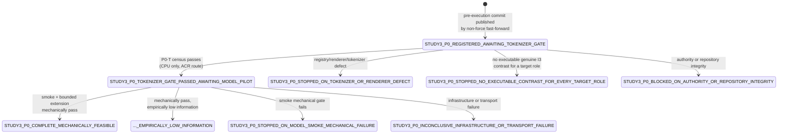

# Study 3-P0 — feasibility pilot

> **State:** `STUDY3_P0_REGISTERED_AWAITING_TOKENIZER_GATE`
>
> `formal_execution_authorized = false` throughout.
> `p0_pilot_execution_authorized = true` only for the operations and caps in the
> operator authority, and it becomes false when the pilot closes or stops.
>
> draft-v0.5 remains an **unreviewed, unfrozen candidate protocol**. P0 does not
> declare it correct, does not reverse or relabel any prior review disposition,
> and does not waive the final independent methods review. `OD2`, `UR-22` and
> every `RP` object remain unresolved and untouched. No seed, bank, development
> result, confirmation access, winner or evidence row exists. The evidence
> ledger remains byte-identical through `EV-0016`.

Authority: [`studies/study3/prompts/study3_p0_feasibility_pilot_authority.md`](../../prompts/study3_p0_feasibility_pilot_authority.md)
(sha256 `80efc7ef8bfe5e3b5e5235f530a44730f185187aa52b85945875fe68ef1eda11`,
29,282 bytes, LF only, no trailing newline).

## What P0 is

A physically isolated, tightly capped test of whether the registered rendering,
tokenization, scoring, parsing, execution, accounting and resource pipeline is
**runnable** on the three already-named target roles.

P0 measurements are **methods-feasibility observations, not Study 3 evidence**.
All pre-existing formal Study 3 counters remain historical facts; P0 counts into
a separate, cumulative, non-resettable pilot namespace.

## What P0 is not

P0 has no authority to select an interface, set or revise a confirmatory
threshold, answer the research question, resolve `OD2` or `UR-22`, freeze Study
3, or authorize formal development or confirmation. It may not estimate a
confirmatory effect size, validate a power calculation, test a draft-v0.5 null,
pass or fail a formal gate, select or rank `S1`/`S2`/`S3`, qualify `S4`, or
compare checkpoints scientifically.

Observed correctness, response variance and discordance are **descriptive at
this sample size**. Zero observed discordance is not proof of invariance and is
not by itself a mechanical failure. Pilot effect sizes may never be used to
choose or justify a threshold, sample size, alpha, seed, bank, profile or
confirmation rule.

## Fixed roles

| role | repository identity | immutable revision |
| --- | --- | --- |
| `RT` | `deepseek-ai/DeepSeek-R1-Distill-Qwen-1.5B` | `ad9f0ae0864d7fbcd1cd905e3c6c5b069cc8b562` |
| `RL` | `Qwen/Qwen2.5-Math-1.5B` | `4a83ca6e4526a4f2da3aa259ec36c259f66b2ab2` |
| `RI` | `Qwen/Qwen2.5-Math-1.5B-Instruct` | `aafeb0fc6f22cbf0eaeed126eff8be45b0360a35` |

Each tokenizer is loaded from the same repository identity and the same
immutable revision as its model. A branch, tag, floating cache entry or
substituted tokenizer is prohibited. `trust_remote_code` remains `false`.

**`RP` is excluded.** No positive-reference candidate is selected, ranked,
downloaded, tokenized, loaded or called, and no `RP` wrapper is created.

## Frozen corpus

Three semantic base-tuple classes, no random seed, no bank row:

| tuple class | registered stem branch | ground truth |
| --- | --- | --- |
| `K2-none-0` | `K2/none/0` | `3` |
| `K3-affine_mod10-1` | `K3/affine_mod10/1` | `3` |
| `K3-permutation_chain-1` | `K3/permutation_chain/1` | `6` |

Allocation:

* `S1` — `K5-P1`, `K5-P2`, `K5-P3`, `K5-S1`, `K5-S2`, `K5-S3`, `K5-A1`,
  `K6-SEP`, `K6-INSTR`;
* `S2` — `K6-INSTR` only;
* `S3` — `K6-INSTR` only, byte-identical prompts to `S2`, rescored on CPU;
* `S4` — the `K2` tuple only, `K6-SEP` and `K6-INSTR`, distinct base identities.

`K6-SEP` is **never instantiated** for `S2` or `S3`. `not_applicable` is
structural absence: not a pass, not a zero, not a duplicate, never a denominator
row.

Every base-item identity lives in `study3-p0-only/<tuple-class>/<profile>-<contrast>`.
The complete `study3-p0-only/` namespace and every semantic tuple used by P0 are
**permanently excluded** from every later development, confirmation, P3-Q and
external-validity bank. P0 data may not be relabelled or promoted later.

35 contrast cells, 70 rendered pair members. After the pre-execution commit is
published these bytes are immutable: no item, prompt, expected answer,
distractor, nuisance state, variant, wrapper or allocation may be changed in
response to tokenizer or model output.

## Operation caps

| unit | maximum |
| --- | --- |
| non-generative prefill evaluations | 180 |
| S4 generation calls | 12 |
| S4 prefill evaluations | 12 |
| S4 incremental decode evaluations | 36 |
| total sequence-level model-evaluation equivalents | 228 |
| S1 scored rows | 162 |
| S2 scored rows | 18 |
| S3 CPU-only reuse scored rows | 18 |
| S4 scored generation rows | 12 |
| total scored rows | 210 |
| tokenizer encoded sequences | 10,000 |
| distinct checkpoint identities downloaded | 3 |
| distinct tokenizer identities constructed | 3 |
| model weight loads | 3 |
| GPU jobs performing a model operation | 1 |
| additional GPU attempt (signed zero-operation receipt only) | 1 |
| hosted-provider inference calls | 0 |
| seeds or bank rows | 0 |
| positive-reference operations | 0 |

The K2 smoke is **exact**, not a maximum: 60 prefill evaluations, 0 incremental
decode evaluations, 66 scored rows of which 6 are S3 reuse rows, 0 S4 generation
calls.

Ineligible tokenizer cells reduce actual counts; they never authorize
replacement rows. Counters are cumulative across every attempt and may never be
reset. Runtime batched forward calls are counted separately and never
substituted for any quantity above. The pilot stops **before** exceeding a cap.

## State machine

The distinction between `..._MECHANICALLY_FEASIBLE` and
`..._EMPIRICALLY_LOW_INFORMATION` is **descriptive** and creates no formal
eligibility difference. A small pilot cannot establish that a contrast has or
lacks a substantive effect.

## Execution route

Code inspection, editing, Git, hashes, upload, submission and result reading may
occur from the workstation. Every **authoritative CPU validation** runs in the
registered Azure Container Registry/container route on a clean exact-commit
checkout. Every **model operation** runs in an Azure containerized GPU job,
never on the workstation and never in GitHub Actions, on one T4-class 16 GiB GPU
or a larger compatible Azure GPU, in fp16, one checkpoint at a time.

## Files

| path | role |
| --- | --- |
| `p0_protocol.json` | machine-readable protocol, caps, state machine, counter ontology |
| `p0_protocol.py` | emits and re-derives `p0_protocol.json` |
| `p0_renderer.py` | independent registry-driven renderer |
| `p0_corpus.py` | deterministic seed-free corpus construction and validity predicates |
| `p0_freeze_corpus.py` | freezes and re-derives the corpus artifacts |
| `p0_counters.py` | cumulative, non-resettable counter ontology and cap enforcement |
| `p0_parser.py` | the pinned deterministic S4 parser; `unparseable` is first class |
| `p0_tokenizer_gate.py` | stage P0-T, CPU only |
| `p0_model_pilot.py` | stage P0-M, GPU job only |
| `p0_summarize.py` | descriptive summaries only |
| `p0_validate.py` | allowlist, protected bytes, identities, counter arithmetic |
| `corpus/` | the frozen corpus, manifest and census |
| `container/` | digest-pinned image and frozen dependencies |
| `results/` | returned artifacts, materialized without editing a scientific value |

The negative tests for every fail-closed transition live in
[`tests/test_study3_p0_feasibility_pilot.py`](../../../../tests/test_study3_p0_feasibility_pilot.py).

## Legal successor

Not another pilot, and not immediate formal execution. The successor is a
fresh-session operator calibration round that reads the P0 feasibility record
and may use only mechanical defect evidence, tokenizer eligibility outcomes,
parser/serialization/runtime behaviour, resource and operation-cost
measurements, and the descriptive fact that the tiny corpus was or was not
empirically informative — without treating its effect sizes as design inputs.

That round must choose one of: repair a demonstrated mechanical or surface
defect in a new candidate protocol; retain the candidate design and add only the
execution details P0 showed were needed; or stop the current Study 3 route as
infeasible. Any surviving candidate must then receive one focused, fresh-session
independent methods review before freeze, seed draw, bank construction, formal
model execution or confirmation.
